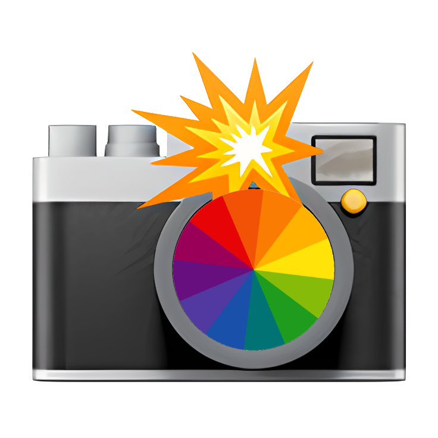

<div style="display: flex; align-items: center; margin-bottom:10px;">
   
  <span style="font-size: 28px; display: inline-block; margin-left: 6px">What Color</span>
</div>

<hr />

This tool aims to answer "What Color is this?" question.

But why on earth this tool was built in the first place? This is because I need a tool to help a [color-blind](https://en.wikipedia.org/wiki/Color_blindness) person like me to recognize color in this world easily by using Camera.

## Local Installation

Run these commands to start the app on your local machine:

### Install dependencies

```
yarn install
```

### Run the development server

```
yarn dev
```

## References

- [Take photos and control camera settings](https://developer.chrome.com/blog/imagecapture)
- [Extracting a color palette from an image with javascript](https://dev.to/producthackers/creating-a-color-palette-with-javascript-44ip)
- [CanvasRenderingContext2D: getImageData() method](https://developer.mozilla.org/en-US/docs/Web/API/CanvasRenderingContext2D/getImageData)
